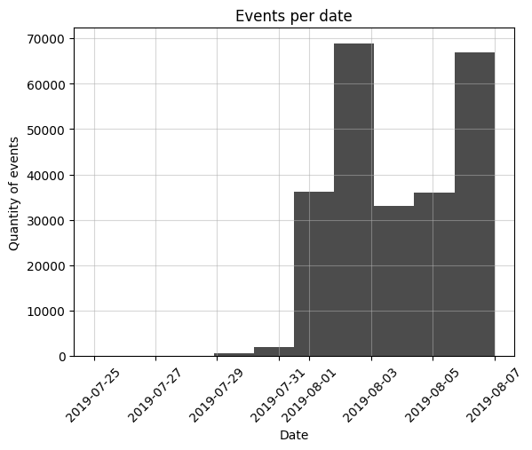
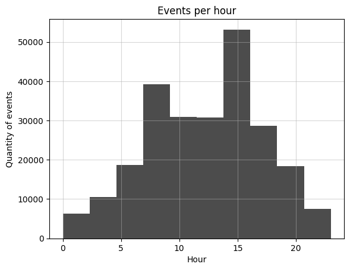
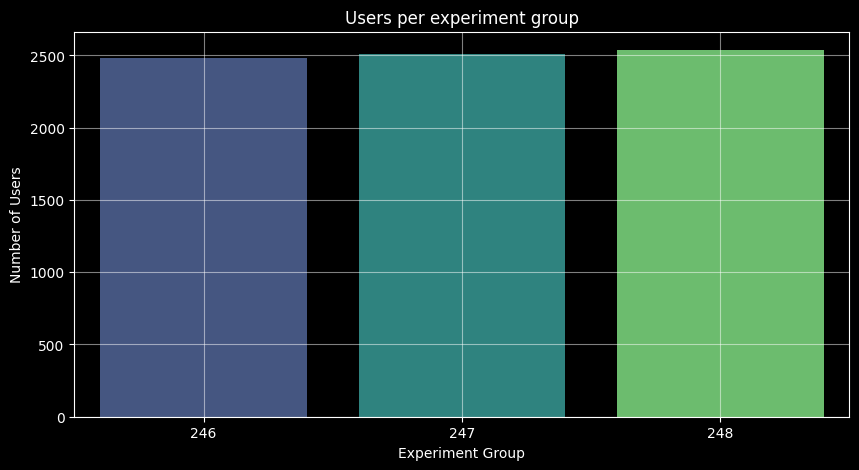

# 🧪 Análisis de Datos - Test AA para Productos Alimenticios

Este proyecto explora el comportamiento de consumidores en un experimento tipo Test A/A sobre productos alimenticios. El objetivo es validar la consistencia de las variantes antes de realizar un test A/B, asegurando que las diferencias observadas no se deban al azar.

---

## 📊 Objetivo del Proyecto

La empresa desea analizar el comportamiento de usuarios bajo dos condiciones idénticas (Test A/A) para:

- Validar la aleatorización del experimento
- Evaluar diferencias estadísticas en comportamiento sin sesgo
- Preparar terreno para un futuro Test A/B

---

## 🧰 Tecnologías Utilizadas

- **Python 3**
- **Pandas** — Manipulación de datos
- **NumPy** — Operaciones numéricas
- **Seaborn & Matplotlib** — Visualización
- **Scipy Stats** — Pruebas estadísticas

---

## 📈 Qué se hizo en el análisis

- Carga y limpieza del conjunto de datos
- Exploración y visualización de variables clave
- Comparación estadística entre los grupos A y A
- Cálculo de conversiones y frecuencias
- Validación de hipótesis mediante pruebas estadísticas (`t-test` y proporciones)

---

## 📊 Visualizaciones

El análisis incluye 4 gráficos que resumen:

1. Distribución de eventos por fecha

    

2. Porcentaje de conversión por hora

    

3. Comparación visual entre los grupos de prueba

    

4. Relación entre frecuencia de eventos y conversión

    

---

## 📌 Resultados clave

- La conversión promedio estuvo en rangos como `0.45`, `0.5` y `0.7` entre los eventos analizados.
- Se identificaron casos con conversión del `0.00%`, lo que permitió validar extremos del comportamiento.
- Los valores no mostraron diferencias significativas entre los grupos, lo cual es consistente con un buen Test A/A.

---

## ✅ Conclusión

Los análisis indican que no hay diferencias estadísticamente significativas entre los grupos A y A, lo que valida la correcta aleatorización del experimento. Las tasas de conversión observadas son similares, reforzando que cualquier variación es atribuible al azar y no a un sesgo sistemático.

Este resultado proporciona una base confiable para realizar futuros experimentos A/B con mayor confianza en los resultados.

---